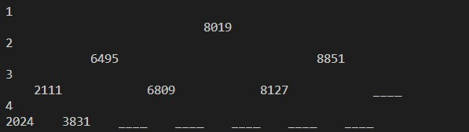
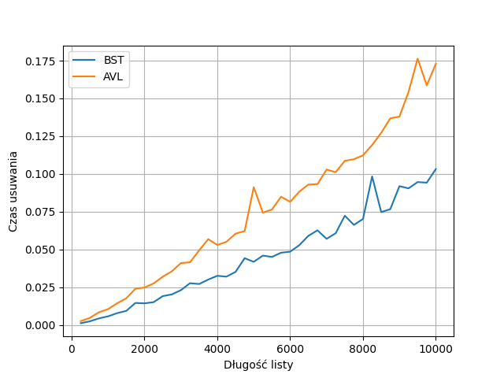

# Drzewa - sprawozdanie

Podział zadań:
- Mateusz Roszkowski - BST
- Kamil Szczepanik - AVL

## Wyświetlanie drzewa

W pliku `BinaryTree.py` znajduje się implementacja drzew oraz przykładowe operacje na nim - tworzenie, dodawanie, szukanie, usuwanie oraz wyświetlanie go.

#### Drzewo BST

#### Drzewo AVL

## Wyniki eksperymentów

### Tworzenie drzew

### Szuaknie w drzewie

### Usuwanie elementów w drzewie

### Wnioski:
- Tworzenie drzew jest szybsze dla BST, ponieważ nie wykonywane są żadne rotacje. 
- Wyszukiwanie w drzewie jest szybsze w AVL, ponieważ te drzewa nie są aż tak wysokie jak BST.
-  Usuwanie jest szybsze dla BST. Wydawałoby się, że tutaj również AVL ma szanse być szybszym algorytmem, ponieważ w usuwaniu wykonywana jest operacja szukania. Widocznie częste rotacje są powodem do wolniejszego działania.