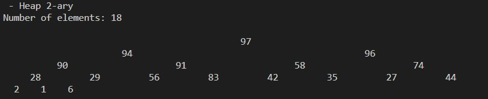
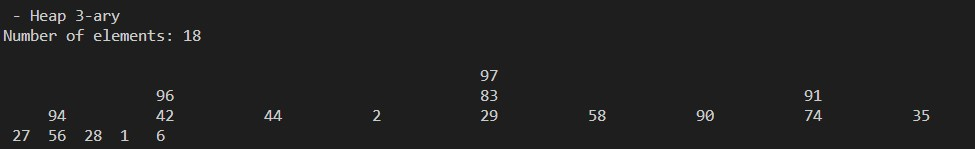
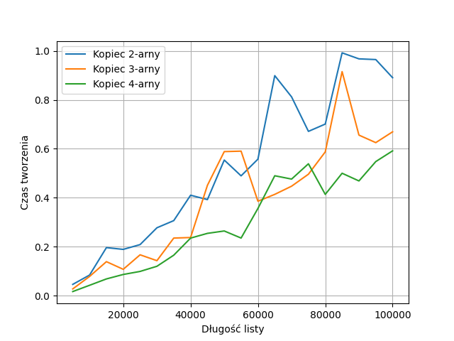
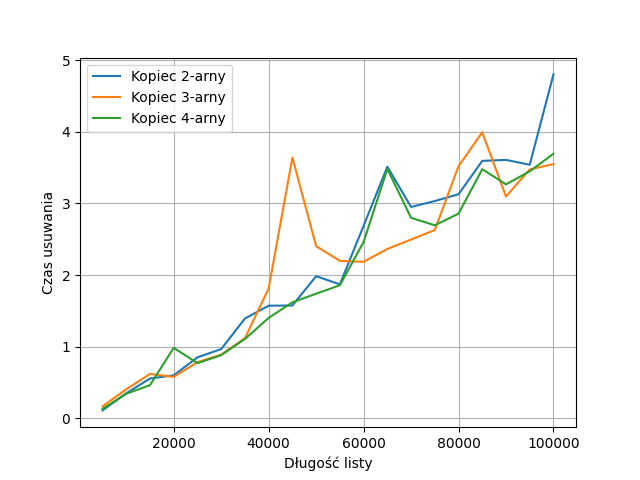

# Kopce - sprawozdanie

Podział zadań:
- Mateusz Roszkowski - metoda `push()`
- Kamil Szczepanik - metoda `pop()`, rysowanie

## Wyświetlanie kopca

W pliku `kopiec.py` znajduje się implementacja kopca oraz przykładowe operacje na nim - tworzenie, usuwanie oraz wyświetlanie go.

W pliku `testowanie.py` znajduje się implementacja testów kopców oraz tworzenia wykresów ich wydajności.

#### Kopiec 2-arny

#### Kopiec 3-arny

#### Kopiec 4-arny

## Wyniki eksperymentów

### Tworzenie kopców

### Usuwanie szczytu kopca

### Wnioski:
- Tworzenie kopca jest tym krótsze im więcej dzieci ma korzeń. Najwolniej tworzyły się kopce binarne a najszybciej kopce 4-arne.
-  Usuwanie szczytu kopca jest w miarę podobne dla 3 badanych typów kopców, jednak wydaje się, że nieco szybszy jest ciągle kopiec 4-arny, co byłoby intuicyjne, ponieważ kopiec 4-arny ma mniejszy rząd, więc może to znaczyć mniej zamian dziecko-rodzic.