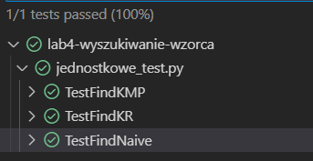
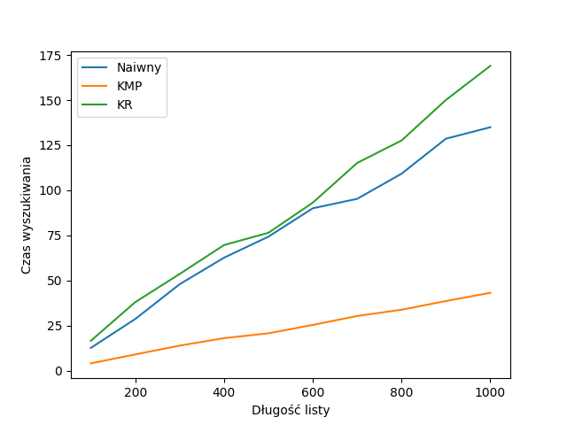
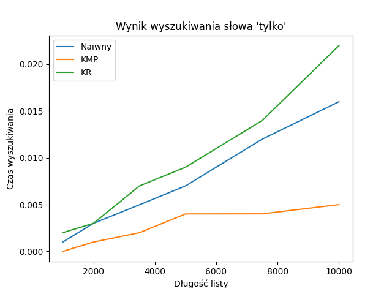
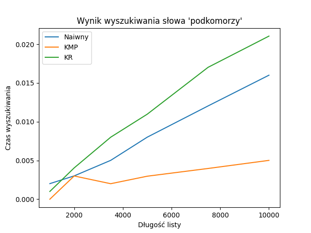

# Wyszukiwanie wzorca - sprawozdanie  

#### Podział zadań:
- Kamil Szczepanik - algorytm Naiwny i algorytm KMP  
- Mateusz Roszkowski - algorytm KR  

## Testy poprawności implementacji:
Testy znajdują się w `tests_pytests.py`, w którym widać testy jednostkowe na wszystkich przypadkach brzegowych, tzn:
- pusty jeden lub oba napisy wejściowe,
- napis string równy napisowi text,
- napis string dłuższy od napisu text,
- napis string nie występuje w text.

## Porównanie algorytmów wyszukiwania wzorca:

### Czas wyszukiwania w całym pliku `n` pierwszych słów wczytanych z pliku
Kod źródłowy pomiaru w pliku `test2.py`

Najlepiej radzi sobie algorytm KMP, a KR i Naiwny mają porównywalny rezultat.

### Szukanie konkrentych słów w N pierwszych słowach tesktu
Wykres przy wyszukiwaniu krótszego słowa

Wykres przy wyszukiwaniu dłuższego słowa.

Algorytm KR radzi sobie najgorzej przy krótkich słowach (pierwsze słowo: "tylko"), ale jest lepszy w dłuższych słowach (drugie słowo: "podkomorzy"), więc przy zastosowaniu powtarzajacych się słów, które są podobne do innych, KR wypadnie o wiele lepiej. 
Algorytm KMP radzi sobie najlepiej ze względu na pomijanie sprawdzonych już wcześniej części tekstu.
