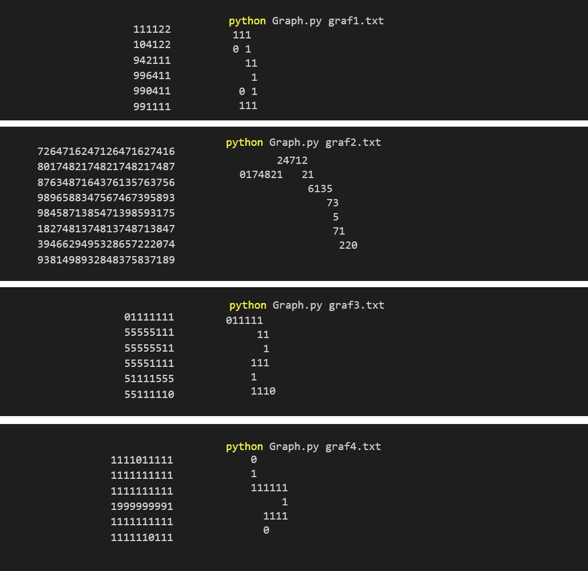

# Grafy- sprawozdanie  

#### Podział zadań:
- Kamil Szczepanik - algorytm Dijkstra
- Mateusz Roszkowski - sprawozdanie i testy

## Implementacja zadania znajduje się w pliku `Graph.py`

## Wyszukiwanie najkrótszej ścieżki wykonano na przykładowych planszach zapisanych w plikach `graf1.txt`, `graf2.txt`, `graf3.txt` i `graf4.txt`

